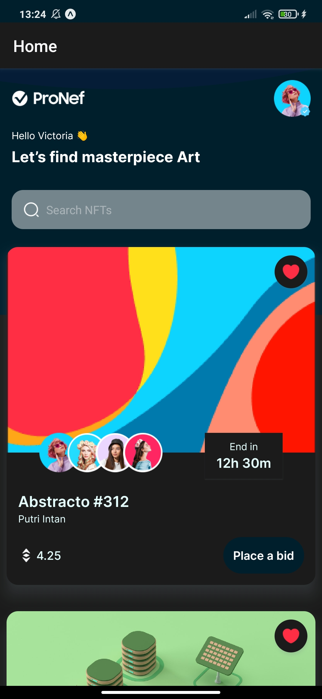
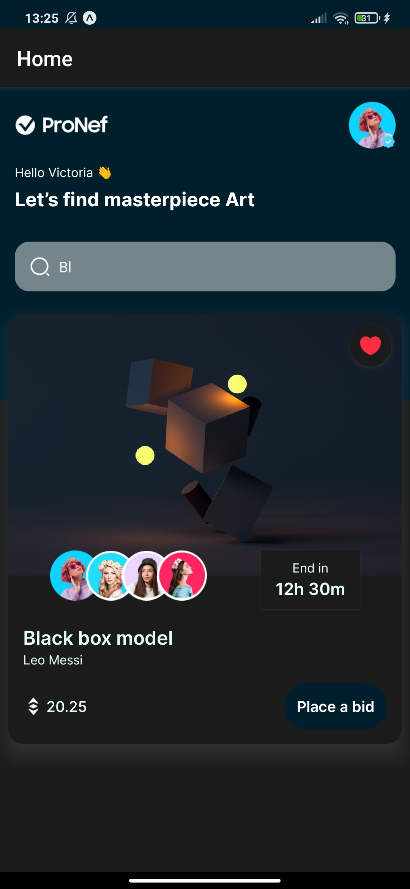
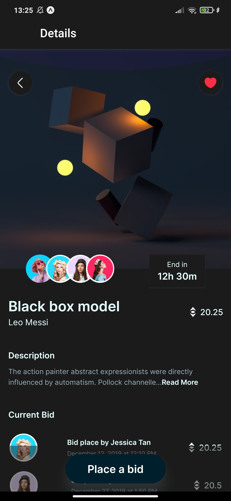
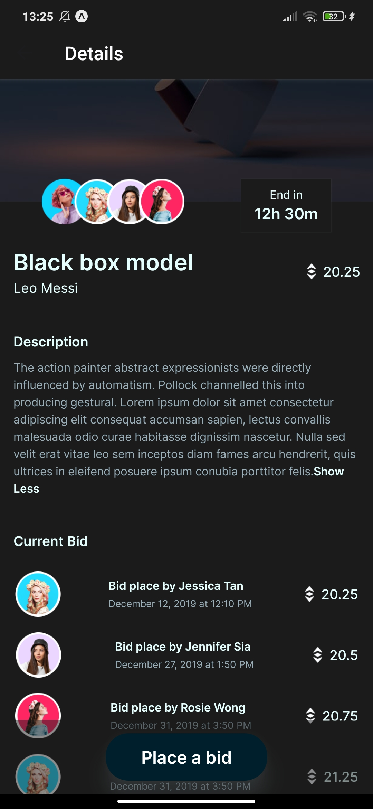

# NFT MARKETPLACE 

# Sobre o projeto

Aplicativo mobile que apresenta uma coleção de nft.

### Explicação

- Exemplo do funcionamento do sistema

#### Usuário

- Na tela principal é apresentado informações do usuário logado, uma area para pesquisar uma nft pelo nome e uma lista de nft com informações sobre ela 
- Quando selecionado a nft a tela de detalhes é aberta e permite que o usuário de uma proposta na nft e tambem favorite ela 

### Tela home


### Tela pesquisa


### Tela detalhes


### Tela detalhes


# 🚀 Começando

Essas instruções permitirão que você obtenha uma cópia do projeto em operação na sua máquina local para fins de desenvolvimento e teste.

## 📋 Pré-requisitos

- expo
- virtual device ou aplicativo expo no smartphone

## 🔧 Instalação
### :warning::warning: **A pasta imgs**: é para guardar as imagens usadas no readme.md! Apagar ela depois do clone :warning::warning:
``` bash

## clonar repositório
git clone https://github.com/PauloCSantos/nft-marketplace.git

## entrar na pasta do projeto
cd nft-marketplace

## instalar as dependencias
expo install

## executar o projeto
expo start

## executar no app expo 
abrir o expo no celular e ler o qrcode

## executar no emulador
pressiona a para abrir no android

## 🛠️ Construído com

- React Native 
- React Native Navigation
- CSS

## ✒️ Autor

* **Paulo C Santos** - [Linkedin](https://www.linkedin.com/in/paulocsantos1995/)

## 🖐️ Agradecimento

Agradeço ao canal JavaScript Mastery pela aula

-Link do canal: https://www.youtube.com/c/JavaScriptMastery
